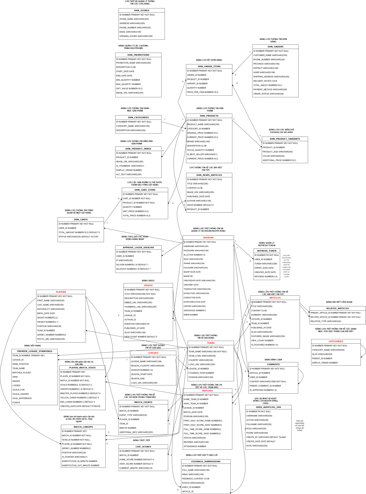

# ⚽ Sports News & E-commerce Platform

A comprehensive full-stack solution for sports enthusiasts, combining a high-traffic news portal with a robust e-commerce system.

## 🚀 Technologies Used
* **Frontend:** Angular, RxJS, Angular Interceptors
* **Backend:** ASP.NET Core, Java Spring Boot (Microservices-ready)
* **Database:** Oracle SQL (Stored Procedures CRUD)
* **Design:** Database Architecture designed via Draw.io

## ✨ Key Features
* **CMS:** Built a robust Content Management System to handle articles, media, and file uploads.
* **E-commerce Workflow:** Complete shopping journey from product display to centralized admin dashboard management.
* **Technical Excellence:** Integrated Rich-text editor and optimized RESTful API calls for seamless performance.

## 📊 Database Architecture
To understand the system's data flow, please refer to our schema design:

 

## 📂 Project Structure
* `ClientApp24hNews`: Angular Frontend source code.
* `WebSport24hNews`: ASP.NET Core Backend source code.
* `clear-all`: Java Spring Boot service logic.
* `Database.drawio`: Technical database schema and system design.

## 🛠️ How to Run
1. **Database:** Execute the SQL scripts in Oracle to create tables and Stored Procedures.
2. **Backend:** Open `WebSport24hNews.sln` in Visual Studio and update the connection string in `appsettings.json`.
3. **Frontend:** Navigate to `ClientApp24hNews`, run `npm install` and then `ng serve`.
